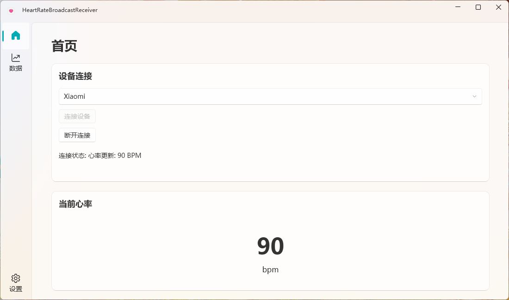
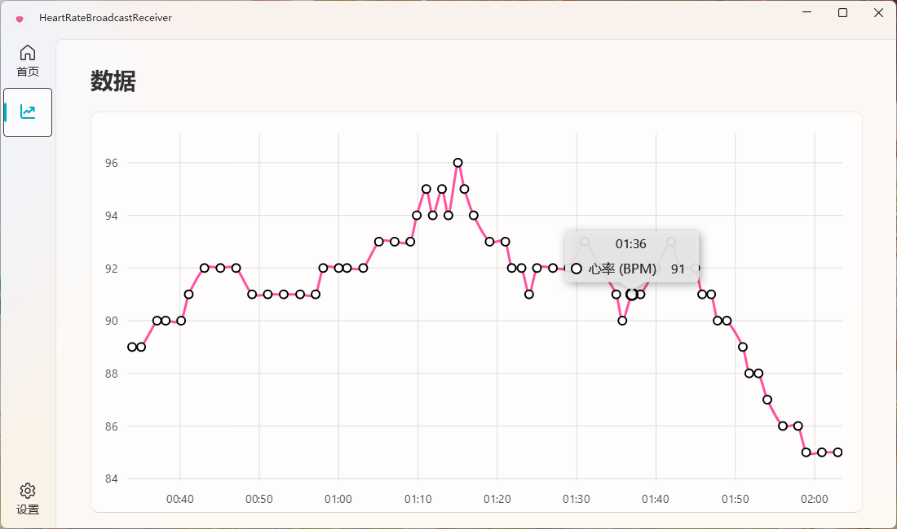

# 心率广播接收器

一款用于监听蓝牙低功耗（BLE）心率监测设备广播并在图表上实时显示心率数据的Windows应用程序。

## 功能特点

- 实时监听蓝牙低功耗心率设备广播
- 实时心率数据显示与可视化图表
- 支持多种品牌的心率监测设备（如未适配，可提交issues）
- 简洁直观的用户界面
- 实时连接状态更新
- 支持OBS（开发中）

## 系统要求

- Windows 10 版本 19041.0 或更高版本
- .NET 9.0 SDK
- 支持BLE的蓝牙适配器

## 安装说明

1. 克隆或下载此代码仓库
2. 在Visual Studio 2022或更高版本中打开解决方案
3. 恢复NuGet包
4. 构建解决方案
5. 运行应用程序

或者，您也可以下载安装包：

**Download：**[The Latest Version](https://github.com/AlierKitten/HeartRateBroadcastReceiver/releases/latest)

## 使用方法

1. 启动应用程序
2. 从下拉菜单中选择您的心率设备
3. 点击"连接"开始监听BLE广播
4. 戴上您的心率监测设备并确保其正在广播数据
5. 在主页查看实时心率数据
6. 导航到数据页面查看历史心率数据图表
7. 点击"断开连接"停止监听

## 技术细节

## 依赖项

- [.NET 9.0](https://dotnet.microsoft.com/download/dotnet/9.0)
- [WPF-UI](https://github.com/lepoco/wpfui)
- [LiveCharts2](https://github.com/beto-rodriguez/LiveCharts2)
- Microsoft.Extensions.Hosting
- CommunityToolkit.Mvvm

## 屏幕截图

### 主页

### 数据可视化
*显示实时心率数据的图表*
